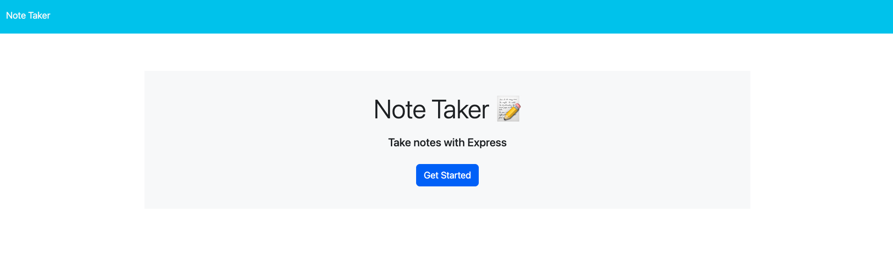
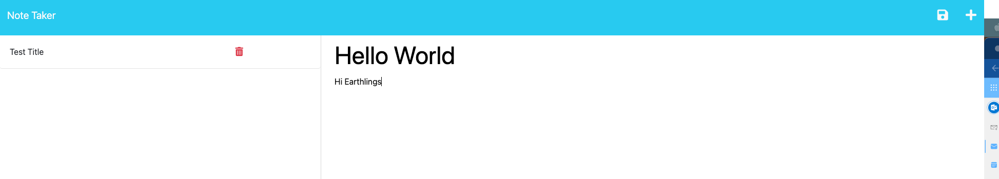
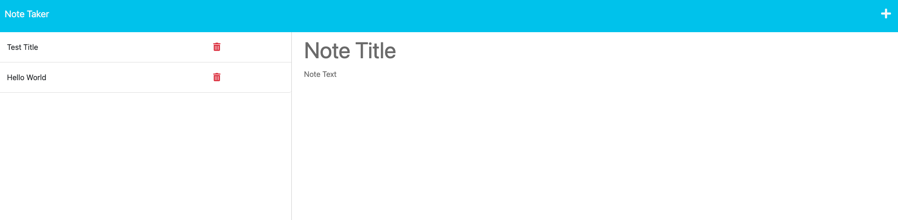

# ExpressJS Note Taker

## Project Description
------
This project is an application called Note Taker that can be used to write and save notes.  It is an application to write and save note with Express.js back end and will save and retrieve note data from JSON file.

## Table of Contents
------  
- [ExpressJS Note Taker](#expressjs-note-taker)
  - [Project Description](#project-description)
  - [Table of Contents](#table-of-contents)
  - [Setup](#setup)
  - [Tools](#tools)
  - [Mock-Up](#mock-up)
  - [License](#license)
  - [Author](#author)
  - [Contact](#contact)
  
## Setup 
------
Clone project. Run the following line of code in your terminal to install all the needed packages:

```
npm i
```

## Tools
------
- HTML
- CSS
- Bootstrap
- JavaScript
- Node.js
- Express.js
  - Uniqid

## Mock-Up 
------
The following image demonstrates the web application's appearance and functionality:







  
## License
------
 A short and simple permissive license with conditions only requiring preservation of copyright and license notices. Licensed works, modifications, and larger works may be distributed under different terms and without source code.    [MIT License](https://choosealicense.com/licenses/mit/)  

  ## Author
  ------
  Nayonna Purnell

  ## Contact
  ------
  * LinkedIn: https://www.linkedin.com/in/nayonnapurnell/
  * Email:  nayonnapurnell@outlook.com

 

